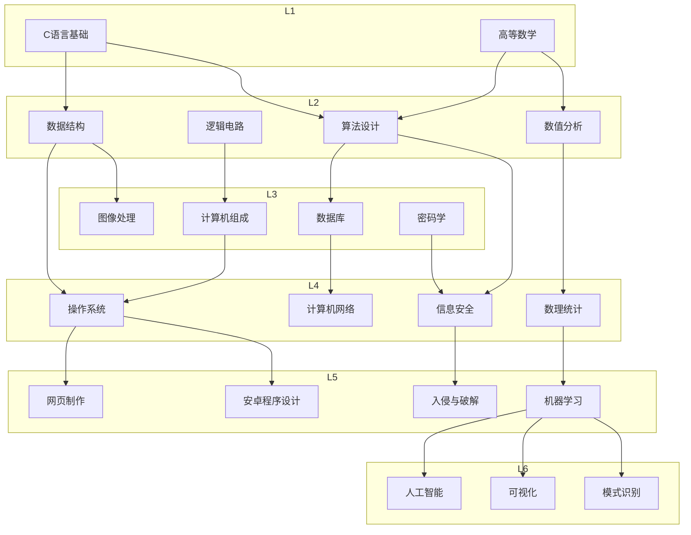

## 属性

### 天赋

* 智慧
  * 抽象能力
  * 逻辑能力
  * 计算能力
  * 想象力
  * 记忆力
* 体魄
  * 耐力
  * 爆发力
  * 技巧
* 艺术
  * 美术
  * 音乐
  * 演艺
* 游戏
  * 英雄联盟
  * 绝地求生
  * 炉石传说
  * 红色警戒
* 魅力
  * 颜值
  * 气质
  * 领导力
  * 口才

### 技能树

## 任务

### 主线任务

#### 中学阶段
1. 新生报到
2. 开学第一课
3. 学习新知识
4. 课堂小测
5. 做作业
6. 获得零花钱
7. 选择兴趣班
8. 学习网购
9. 职业生涯规划
10. 赢得约战
11. 提交入团申请书
12. 

#### 本科阶段
1. 探索校园
2. 安排课表
3. 申请专业
4. 

#### 硕士阶段
1. 布置实验室
2. 

#### 职场阶段
1. 领工资
2. 公司聚会
3. 给大佬递茶
4. 

### 支线任务

#### 学业任务
1. 获得奖学金
2. 发表论文
3. 

#### 生活任务
1. 买车
2. 买房
3. 

#### 爱情任务
1. 表白成功
2. 

#### 理想任务
1. 加入共青团
2. 成为积极分子
3. 成为预备党员
4. 加入共产党

### 日常任务

* 起床
* 

## 主题

### 公司架构

#### 政府（预设）

省长、省委书记 -> 市长、市委书记 -> 区长、区委书记 -> 公务员

#### 研究所

所长 -> 科长 -> 组长 -> 研究员

#### 竞技团队

总经理 -> 主教练 -> 助教 -> 队员

#### 软件公司

董事长 -> 架构师 -> 主管 -> 程序员

#### 产品公司

董事长 -> 经理 -> 工程师 -> 工人

#### 餐饮公司

董事长 -> 经理 -> 领班 -> 工人

#### 教育公司

校长 -> 办公室主任 -> 教师组长 -> 教师

#### 医务公司

院长 -> 医务主任 -> 主治医师 -> 护士

#### 建筑公司

董事长 -> 经理-> 包工头 -> 工人

#### 影视公司

董事长 -> 导演 -> 经纪人 -> 艺人

#### 金融公司

董事长 -> 金融顾问 -> 投资经理 -> 会计

### 公司规模

1. 1/1/2/4(8)
2. 1/2/3/8(14)
3. 1/2/5/12(20)
4. 1/2/8/15(26)
5. 1/3/10/18(32)
6. 1/3/12/24(40)
7. 1/5/16/32(54)
8. 2/8/20/50(80)

### 运营模式

#### 日常

* 上班打卡
* 下班打卡
* 工资结算
* 公司聚餐
* 商业斗争
* 

#### 研发

* 公司规模

* 工作效率
* 智慧结晶
* 

## 增益

### 道具

#### 文具店

- 转转笔
- 

#### 小吃店

- 能量饮料
- 

#### 服装店

- 金边墨镜
- 

#### 礼品店

- 定情戒指
- 

#### 魔法屋

- 时光机
- 

### 收藏

* 艺术品
* 古董
* 首饰

### 纪念品

* 幸运挂坠
* 

## 彩蛋

### 成就
* 不学无术：连续三天不写作业。
* 为爱痴狂：为情侣花费十万金钱
* 

