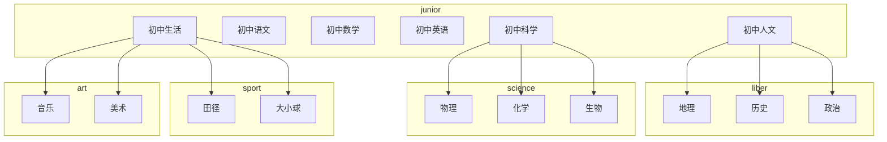
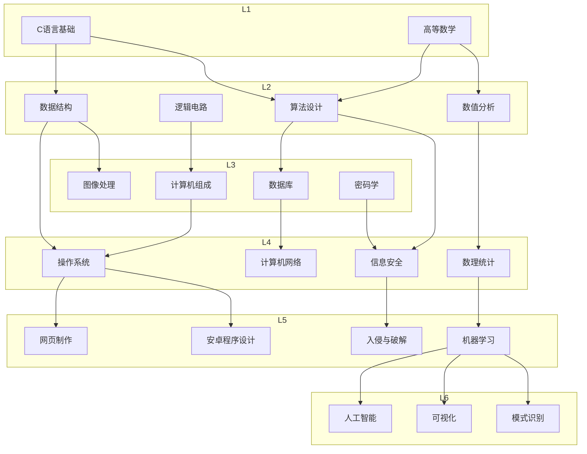

## 主循环

### 初级

时间 -> 精力 (自动)

时间 -> 属性 (自动)

时间 -> 比特 (收取)

时间 -> 金钱 (日常)

### 中级

比特 + 时间 -> 家装 (升级)

精力 + 时间 -> 金钱 (活动)

精力 + 时间 -> 物品 (活动)

时间 -> 技能 (学习)

比特 -> 物品 (网购)

精力 -> 物品 (约战)

金钱 -> 物品 (商店)

### 高级

物品 -> 属性 (使用)

钻石 -> 金钱 (充值)

## 属性

### 天赋

* 智慧
  * 抽象能力 ♂ 96 ♀ 32
  * 逻辑能力 ♂ 80 ♀ 60
  * 计算能力 ♂ 40 ♀ 40
  * 想象力 ♂ 60 ♀ 72
  * 记忆力 ♂ 20 ♀ 80
* 体魄
  * 耐力 ♂ 120 ♀ 64
  * 爆发力 ♂ 80 ♀ 6
  * 灵活度 ♂ 40 ♀ 60
* 艺术
  * 美术 ♂ 32 ♀ 80
  * 音乐 ♂ 60 ♀ 60
  * 演艺 ♂ 40 ♀ 48
* 游戏
  * 英雄联盟 ♂ 0 ♀ 0
  * 绝地求生 ♂ 0 ♀ 0
  * 炉石传说 ♂ 0 ♀ 0
  * 红色警戒 ♂ 0 ♀ 0
* 魅力
  * 颜值 ♂ 20 ♀ 20
  * 气质 ♂ 20 ♀ 20
  * 领导力 ♂ 20 ♀ 20
  * 口才 ♂ 20 ♀ 20

### 技能树

#### 中学

#### 大学

##### 计算机

## 任务

### 主线任务

#### 中学阶段
1. 新生报到 (注册信息)
2. 开学第一课 (开始学习)
3. 学习新知识 (学习完成)
4. 课堂小测 (测试活动)
5. 做作业 (作业活动)
6. 获得零花钱 (日常领取)
7. 收取比特 (比特生产)
8. 选择兴趣班 (上课活动)
9. 学习网购 (比特购物)
10. 职业生涯规划 (职业计划)
11. 赢得约战 (约战胜利)
12. 提交入团申请书 (理想任务)
13. 升级电脑 (家装升级)
14. 

#### 本科阶段
1. 探索校园 (解锁商店)
2. 申请专业 (选择方向)
3. 安排课表 (自动学习)
4. 打工 (赚钱活动)
5. 

#### 硕士阶段
1. 布置实验室 (解锁机器)
2. 完成导师的任务 (研究活动)
3. 领取经费 (日常领取)
4. 

#### 职场阶段
1. 领工资 (日常领取)
2. 公司聚会 (聚会活动)
3. 给大佬递茶 (递茶活动)
4. 

### 支线任务

#### 学业任务
1. 获得奖学金
2. 竞赛获奖
3. 获评优秀学生
4. 发表论文
5. 

#### 生活任务
1. 买车
2. 买房
3. 

#### 爱情任务
1. 表白成功
2. 

#### 理想任务
1. 加入共青团
2. 成为积极分子
3. 成为预备党员
4. 加入共产党

### 日常任务

* 起床
* 约战
* 获得收入
* 帮助他人
* 购物
* 提升智慧
* 学习技能
* 

## 主题

### 公司架构

#### 政府（预设）

省长、省委书记 -> 市长、市委书记 -> 区长、区委书记 -> 公务员

#### 研究所

所长 -> 科长 -> 组长 -> 研究员

#### 竞技团队

总经理 -> 主教练 -> 助教 -> 队员

#### 软件公司

董事长 -> 架构师 -> 主管 -> 程序员

#### 产品公司

董事长 -> 经理 -> 工程师 -> 工人

#### 餐饮公司

董事长 -> 经理 -> 领班 -> 工人

#### 医务公司

院长 -> 医务主任 -> 主治医师 -> 护士

#### 建筑公司

董事长 -> 经理-> 包工头 -> 工人

#### 影视公司

董事长 -> 导演 -> 经纪人 -> 艺人

#### 金融公司

董事长 -> 金融顾问 -> 投资经理 -> 会计

### 公司规模

1. 1/1/2/4(8)
2. 1/2/3/8(14)
3. 1/2/5/12(20)
4. 1/2/8/15(26)
5. 1/3/10/18(32)
6. 1/3/12/24(40)
7. 1/5/16/32(54)
8. 2/8/20/50(80)

### 运营模式

#### 日常

* 上班打卡
* 下班打卡
* 工资结算
* 公司聚餐
* 商业斗争
* 员工互助
* 

#### 研发

* 公司规模（提升容量）
* 生财之道（提升利润百分比）
* 工作效率（提升工作速度）
* 智慧结晶（增加员工智慧）
* 团结力量（提升互助效率）
* 

## 增益

### 道具

#### 文具店

- 转转笔
- 修正带
- 比特兑换券
- 

#### 小吃店

- 能量饮料
- 麻辣烫
- 

#### 服装店

- 金边墨镜
- 格子衫
- 

#### 礼品店

- 定情戒指
- 

#### 魔法屋

- 时光机
- 分身机甲
- 

### 精灵

* 史诗

  天眼、多面体、血小板、玉兔、蓝月、金苹果

* 稀有

  卫龙、

* 精良

* 高级

* 普通

  大黄、二哈、

### 收藏

* 艺术品
* 古董
* 首饰

### 纪念品

* 幸运挂坠
* 

## 彩蛋

### 成就
* 不学无术：连续三天不写作业。
* 为爱痴狂：为情侣花费十万金钱
* 

